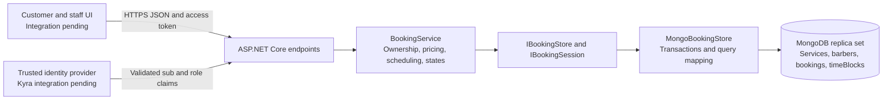
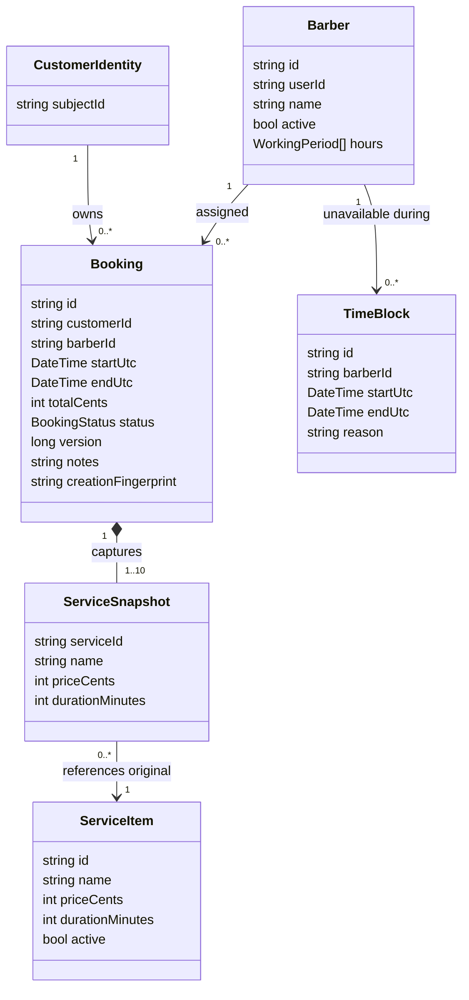
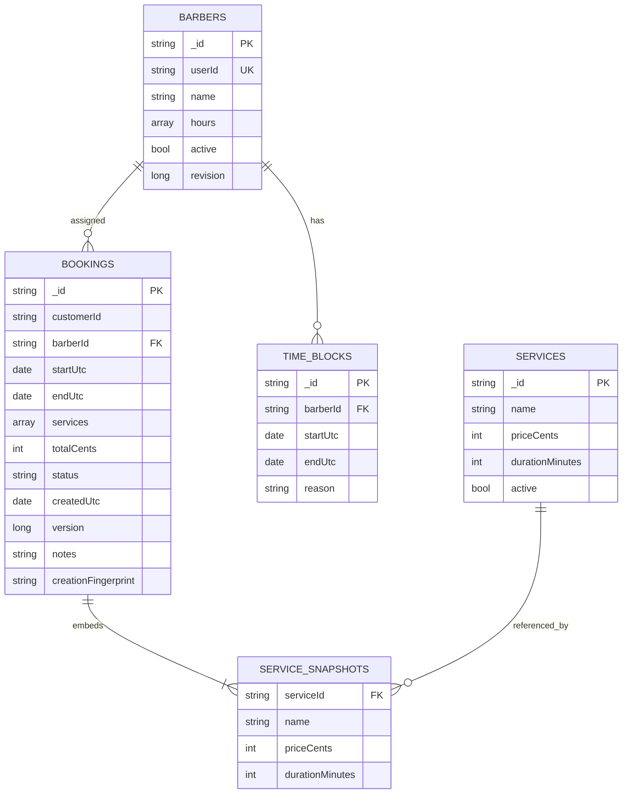
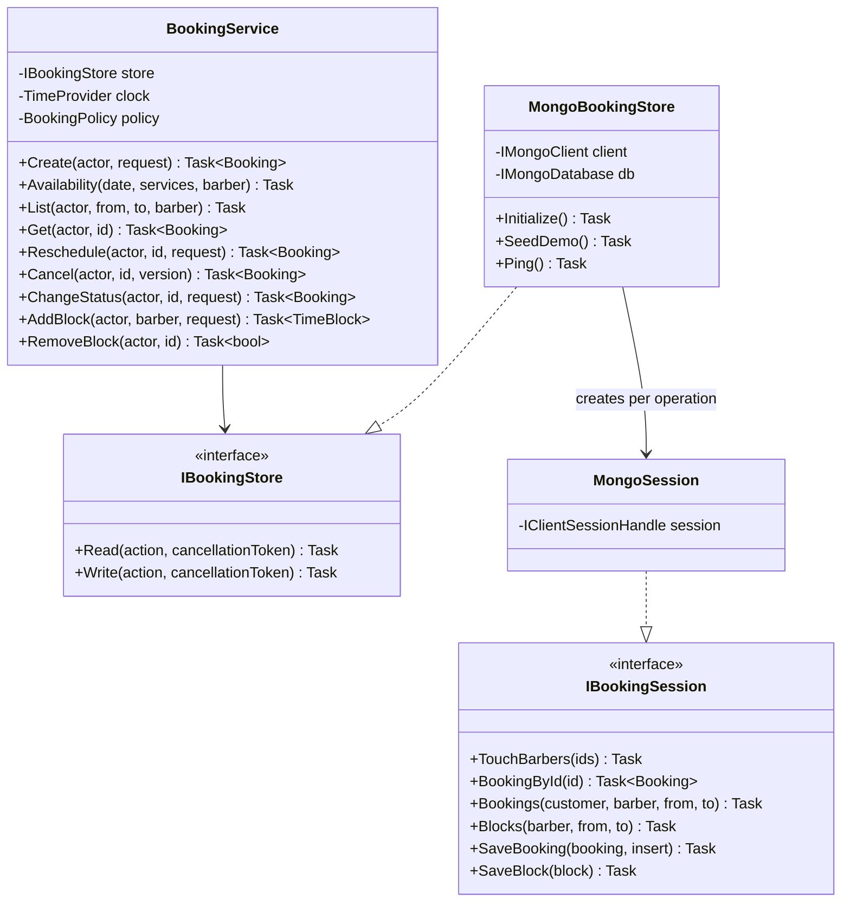
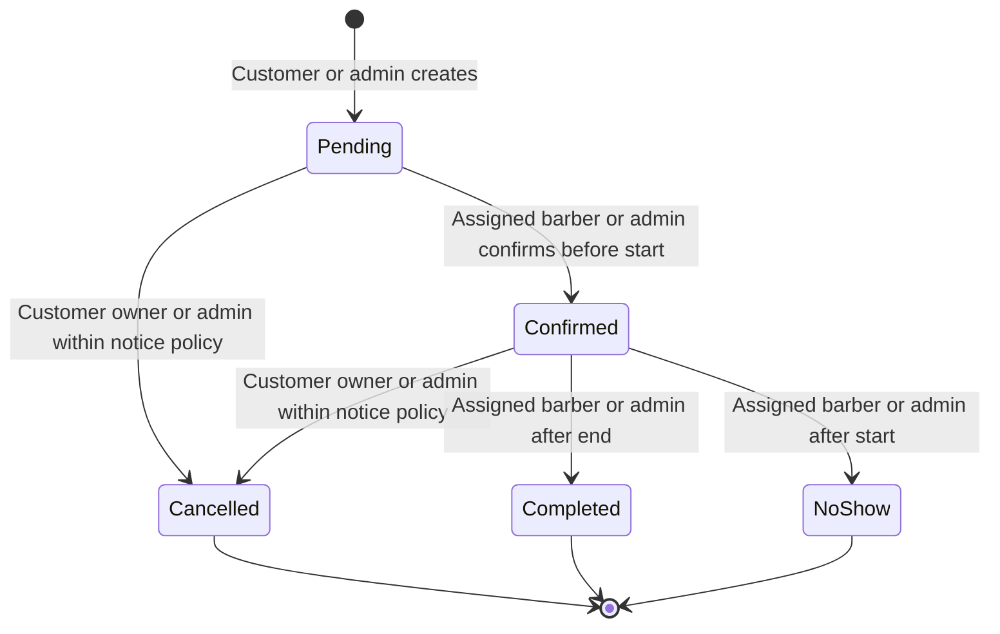
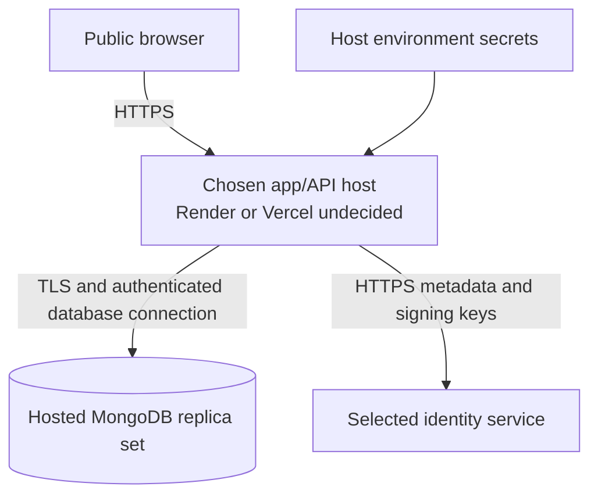

# Booking backend architecture and data design

This implementation replaces the planned Azure SQL/Entity Framework booking persistence with MongoDB. It retains C#/ASP.NET Core and provides HTTP APIs; integrating them into the final front end and choosing hosting remain group work. This document describes implemented behavior, with unconfirmed client rules listed explicitly in the run guide.

## Layers and responsibilities



Endpoints handle HTTP serialization, authentication and response codes. `BookingService` owns business rules and depends on repository interfaces, a clock and a configurable policy. `MongoBookingStore` implements persistent queries and transactions. Tests substitute a transactional test double for fast rule checks and also run against real MongoDB for concurrency/rollback behavior. No in-memory repository is registered by the production application.

The patterns actually used are dependency injection, repository abstraction and a transaction/unit-of-work boundary. Do not claim Factory, Strategy or Observer implementations just because they appeared in the Part 1 plan. Email integration can later consume committed booking events, but no event/outbox system is currently implemented.

## Domain relationships



CustomerIdentity is an external authentication/account integration concept, not an implemented collection. The API enforces ownership using trusted token subject IDs. Customer registration and verifying administrator-supplied customer IDs against the account store are Kyra integration tasks.

## MongoDB collection model



FK labels show logical references; MongoDB does not automatically enforce SQL-style foreign keys. Services are validated by application rules when a booking is created. Barbers must exist. Administrator code must deactivate referenced services/barbers instead of deleting their historical records. Embedded service snapshots replace the old BookingService junction-table concept for this slice, preserving booked prices, names and durations when the catalogue changes. A booking and its snapshots can be read together.

`services`, `barbers`, `bookings` and `timeBlocks` have MongoDB JSON-schema validators. The executable definitions are in `src/Kinsmen.Api/Infrastructure/Schemas.cs`; export copies are under `schemas/` beside this document. Validators enforce required fields, BSON types, basic ranges and booking-status vocabulary. Application rules additionally enforce temporal relationships, totals, references, access and overlap constraints. Validators alone do not provide referential integrity or prevent double booking.

Money is stored in integer ZAR cents. Timestamps are BSON dates in UTC; presentation uses Africa/Johannesburg. Working periods store ISO weekdays (Monday=1 through Sunday=7) and minutes since local midnight. Periods should have start < end; overnight working shifts are not implemented. An appointment can end at midnight when a same-day period ends at minute 1440.

| Collection | Index | Purpose |
|---|---|---|
| All | `_id` unique, MongoDB default | Stable record lookup |
| barbers | `userId` unique | One barber profile per staff identity |
| bookings | `barberId`, `startUtc`, `endUtc` | Barber schedule and overlap query filtering |
| bookings | `customerId`, `startUtc` | Customer booking list |
| timeBlocks | `barberId`, `startUtc`, `endUtc` | Barber availability exclusions |

These indexes support queries; performance/load targets have not yet been measured on a hosted environment. The overlap query is `existing.start < requested.end AND existing.end > requested.start`. A unique start-time index alone would not prevent partial overlaps between appointments of different lengths.

## Implementation classes



## Preventing concurrent booking conflicts

Each schedule-changing transaction first increments `barbers.revision` for every relevant barber, then queries booking/time-block overlaps and performs the change. Transactions use snapshot reads and majority writes. Two concurrent transactions touching the same barber cannot both commit against an old schedule: MongoDB produces a write conflict, and the driver's transaction callback retries against a fresh snapshot.

The transaction includes both the revision write and the booking or block write. A failed reschedule aborts all writes and leaves the original booking intact. This works across separate application/store instances; an in-process lock alone would not. Any-barber creation touches candidates in sorted ID order and is intentionally conservative for a small single-shop workload. It trades extra contention for a simple correctness boundary. Reassess this design if the client later expands to many branches/barbers.

```mermaid
sequenceDiagram
    actor Customer
    participant API
    participant Rules as BookingService
    participant DB as MongoDB transaction
    Customer->>API: POST booking with service IDs and start
    API->>Rules: Validated identity and request
    Rules->>DB: Begin transaction
    Rules->>DB: Increment candidate barber revisions
    Rules->>DB: Read catalogue, bookings and blocks
    Rules->>Rules: Compute total and duration; check hours and overlaps
    alt Time is available
        Rules->>DB: Insert Pending booking with snapshots
        DB-->>Rules: Commit
        Rules-->>API: Persisted booking
        API-->>Customer: 201
    else Slot unavailable
        Rules->>DB: Abort transaction
        API-->>Customer: 409 booking_conflict
    end
```

The same transaction discipline must be used by future admin scheduling code. Do not introduce direct writes that bypass this boundary. Tests exercise independent store instances racing for the same slot, a booking racing a time block, and failed rescheduling with a fresh connection reading the original data.

### Idempotent creation

When an `Idempotency-Key` is supplied, a SHA-256 hash of the authenticated subject and key becomes the booking ID. A separate hash captures the normalized original request, including target customer, requested barber or any-barber choice, service IDs, UTC start and notes. Retrying the same request reads and returns the existing booking. A different request using the same key returns a conflict.

The unique MongoDB `_id` index also protects cases where competing requests with the same key try different barbers and therefore touch different schedule documents. One insert wins. The losing transaction aborts; the service reads the winner outside the aborted transaction and checks its fingerprint. Thus request deduplication is database-backed across application instances, not an in-memory cache. Price/catalogue changes do not alter the result of a retry, because the existing booking's snapshots are retained. The internal fingerprint is excluded from HTTP responses. No automatic TTL deletion is applied to booking history or keys.

## State transitions and update conflicts



Rescheduling is allowed for Pending/Confirmed before the notice deadline and preserves status. Every successful booking mutation increments `version`; stale versions produce `409 stale_version`. Pending, Confirmed, Completed and NoShow records occupy their original interval; Cancelled does not. Historical records are retained, not deleted. There is no staff override of the notice policy or reopening of final states in this version.

## Deployment boundary and limitations



This is a proposed deployment topology, not evidence of a deployed service. MongoDB replaces Azure SQL; it does not replace the web host. No Azure packages, App Service settings, SQL migration pipeline or Azure connection strings are used by this implementation. Select the host with a runtime compatibility trial and keep database credentials server-side.

The API currently does not provide registration, password reset, production token issuance, email/outbox delivery, reviews, shop checkout or admin catalogue editing. It does not verify administrator-supplied customer IDs against a real account collection. Group integration must complete these applicable requirements. Configure trusted proxy behavior, exact frontend origins (if separate), TLS, runtime secrets, test/release gates, backups and monitoring on the selected host. Do not describe local unit tests as production availability evidence.

Official implementation references: [MongoDB transactions](https://www.mongodb.com/docs/drivers/csharp/current/crud/transactions/), [MongoDB atomicity](https://www.mongodb.com/docs/manual/core/write-operations-atomicity/), [ASP.NET Core authentication and authorization](https://learn.microsoft.com/en-us/aspnet/core/fundamentals/minimal-apis/security?view=aspnetcore-10.0).
